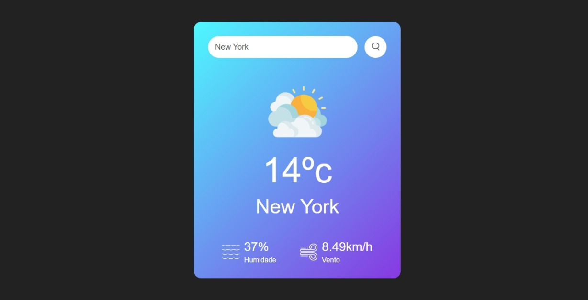

<h1>Aprensento a você um projeto simples feito com (HTML, CSS, JavaScript).</h1>

Basicamente esse projeto consome uma API (OpenWeatherMap) que mostra os dados meteorologicos atualizados sobre a Cidade, Estado ou Pais que for escolhida.

<h2>Dados fornecidos:</h2>

Essa API fornece varios dados sobre o clima, mas escolhi alguns em especifico para este projeto:

Temperatura - Nome - Humidade - Velocidade do Vento

E a imagem muda de acordo com o clima (Ensolarado, Nublado, Chuvoso etc...)

De olho na responsividade tentei deixar o mais responsivo que consegui, ate os tamanho 320px acredito que ficou bem bacana

